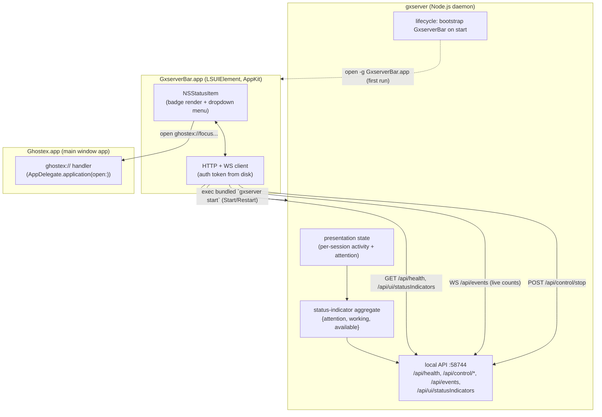
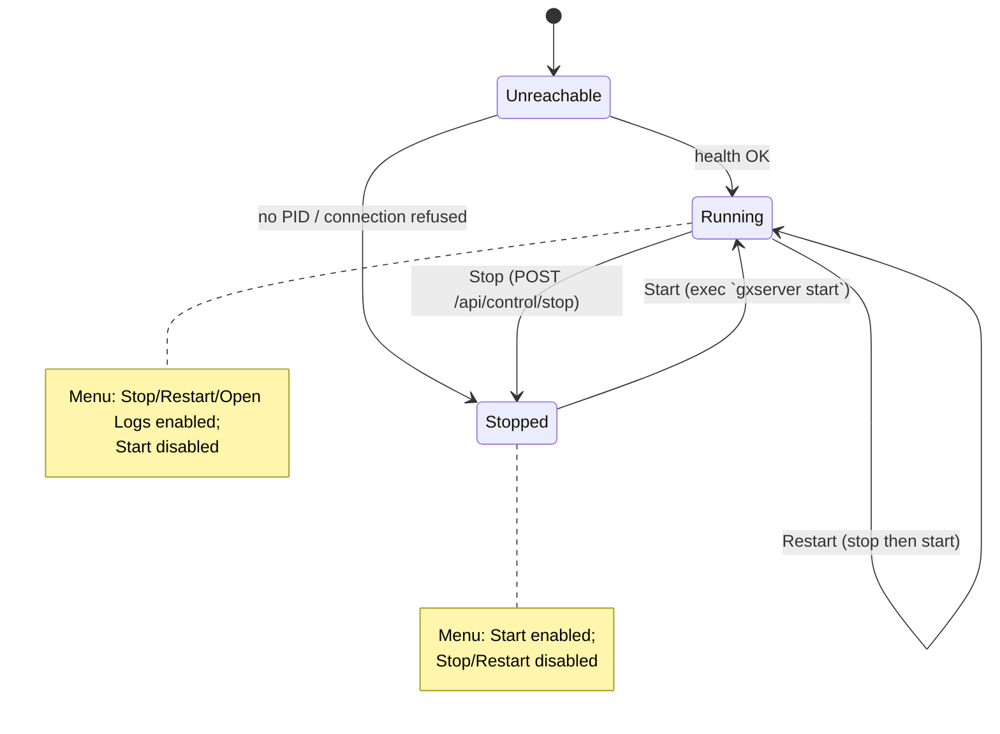

# feat: gxserver Menu Bar Agent

## Summary

Today the macOS menu bar status item lives inside the main `Ghostex.app` (`SessionStatusIndicatorController`). It renders session-status badges (attention / working / available counts) fed by the React sidebar, and clicking it focuses a session in the sidebar. It only exists while the main window app is running.

This plan **moves the menu bar presence out of the main app and into a gxserver-owned, standalone LSUIElement agent** (`GxserverBar.app`). The new agent:

- Shows the daemon's run state and provides **server control** — Start / Stop / Restart, Open Logs, Quit.
- Continues to show the **session-status indicator** (attention / working / available), but now derived from gxserver's own presentation state instead of the React sidebar.
- Talks to the daemon over the existing local HTTP + WebSocket API on `127.0.0.1:58744`.
- **Outlives the daemon** so it can start the server when it's stopped; gxserver bootstraps it on first run.

After the move, `SessionStatusIndicatorController` is removed from `Ghostex.app` entirely. Floating / in-window indicators (if any) are explicitly out of scope and must be preserved.

---

## Problem Frame

The menu bar status item is currently coupled to the main window app and to the React sidebar as its data source. That has two problems the user wants solved:

1. **Wrong owner.** The daemon (gxserver) is the long-lived process that survives the app being closed (`AppDelegate.swift:769` — "Closing or quitting the macOS app must not stop gxserver"). A control surface for the server should live with the server, not the window app that comes and goes.
2. **No server control.** The current icon is a passive status indicator. The user wants the menu bar to actually **control the server** (start/stop/restart/logs), which the main-app indicator never did.

The hard constraint: **gxserver is a pure Node.js daemon and cannot render an `NSStatusItem`** — AppKit menu bar items require a GUI process. So "move to gxserver" means gxserver *owns and launches* a thin native menu bar agent and supplies its data, not that Node draws the menu bar itself.

---

## Requirements

- **R1.** A standalone macOS menu bar agent (`GxserverBar.app`, LSUIElement) presents an `NSStatusItem` and a dropdown menu.
- **R2.** The menu exposes server control: **Start**, **Stop**, **Restart**, **Open Logs**, **Quit agent** — with items enabled/disabled based on current daemon state.
- **R3.** The status item reflects live daemon run state (running / stopped / unreachable) and the session-status indicator counts (attention / working / available).
- **R4.** Indicator counts are derived from **gxserver presentation state** (the single source of truth), not from the React sidebar.
- **R5.** The agent reads the daemon health/control/event APIs over `127.0.0.1:58744` using the existing bearer token at `~/.ghostex/gxserver/auth/token`.
- **R6.** The agent **persists across daemon stop/restart** so it can Start the daemon when down. gxserver bootstraps the agent on startup if it isn't already running.
- **R7.** Clicking the status item (or a session badge) focuses / launches the main `Ghostex.app` via the existing `ghostex://` URL scheme.
- **R8.** `SessionStatusIndicatorController` and its menu bar wiring are removed from `Ghostex.app`. Floating / in-window indicators (if separate) are preserved.
- **R9.** The agent is built and bundled with gxserver, gated to macOS; Linux/standalone server packaging is unaffected.

---

## High-Level Technical Design

### Process & data flow (target state)



### Server-control state machine (menu enablement)



The agent persists in all states. When `Stopped`/`Unreachable`, the agent is the only surviving control surface, which is why Start cannot depend on the daemon being alive.

---

## Output Structure

New native target (paths illustrative; the implementer may adjust layout):

```text
native/macos/gxserverBar/
├── project.yml                      # or a new target added to the existing native/macos/ghostexHost/project.yml
└── Sources/gxserverBar/
    ├── main.swift                   # NSApplication bootstrap, LSUIElement
    ├── GxserverBarAppDelegate.swift # status item lifecycle, menu, polling/WS wiring
    ├── GxserverBarClient.swift      # slim HTTP/WS + auth-token client (ported from GxserverClient.swift)
    ├── StatusIndicatorRenderer.swift# badge image rendering (moved from SessionStatusIndicatorView)
    └── ServerControl.swift          # start/stop/restart + open-logs + ghostex:// focus
```

The per-unit `**Files:**` sections remain authoritative.

---

## Key Technical Decisions

- **KTD1 — Standalone LSUIElement agent, not a main-app helper.** `GxserverBar.app` is a separate bundle so it can survive `Ghostex.app` being closed and be owned by gxserver. (Confirmed with user.) Trade-off: a second signed/notarized bundle to package and a second process; accepted because the daemon-survival requirement (R6) and "owned by the server" intent demand independence.

- **KTD2 — Indicator counts are aggregated server-side in gxserver.** Rather than porting the sidebar's bucket-mapping into Swift, gxserver derives `{attentionCount, workingCount, availableCount}` from its existing presentation activity (`GxserverPresentationSessionActivity = "attention" | "idle" | "working"`, `gxserver/protocol/index.ts:975`) and exposes it via a GET endpoint + a field on the event-stream broadcast. This makes gxserver the single source of truth (R4) and avoids divergence between the sidebar and the agent. Trade-off: a small new aggregation + endpoint vs. duplicating mapping logic in Swift; chosen for single-source-of-truth.

- **KTD3 — Agent persists; Start/Restart shell out to the bundled `gxserver` launcher.** The agent is never killed by daemon stop. To Start the daemon when down, the agent execs the packaged `gxserver` launcher script (which resolves the bundled Node — created by `package-gxserver.mjs`), i.e. `gxserver start`. Stop uses `POST /api/control/stop`; Restart = stop then start. Trade-off vs. a new `/api/control/restart` endpoint: a restart endpoint can't help when the daemon is already down, so exec-based Start is required regardless; Restart reuses it for symmetry.

- **KTD4 — gxserver bootstraps the agent on startup, idempotently.** On `runGxserverForeground`/background start, gxserver launches `GxserverBar.app` via `open -g` **only when it can resolve the staged bundle** (see U3); absent bundle is a no-op. Trade-off: relying on `open -g` keeps gxserver from needing to manage the process handle (matching how the main app already treats the daemon as detached).
  - **OPEN — reboot persistence mechanism is unresolved.** `SMAppService.loginItem` requires the agent bundle to live inside a parent app's `Contents/Library/LoginItems/` — it cannot register an arbitrary gxserver-staged standalone `.app`, and login items can be user-disabled or unregistered on Sparkle app-update. So "returns after reboot" as originally stated does not hold for the chosen bundle layout. Candidate resolutions (decide before U3): (a) a `~/Library/LaunchAgents/` plist owned by the install; (b) accept daemon-driven bootstrap only (agent returns when the daemon next starts, not on cold reboot); (c) relocate the agent bundle to a login-item-eligible location. See Open Questions.

- **KTD7 — `NSStatusItem` interaction model (click vs. menu).** A status item cannot natively expose both a bare click action and an attached `NSMenu` — attaching a menu makes macOS intercept every click to open it. Resolution (recommended, confirm before U2): **attach the menu**, make **"Open Ghostex"** its first item (satisfies R7 app-focus), and place session-focus actions as menu items rather than relying on badge sub-region clicks (the badge is a single hit target with no native sub-region routing). This reframes R7 from "click the icon" to "menu item," and folds session-focus into the menu. See Open Questions.

- **KTD5 — Cross-process focus via `ghostex://`.** Clicking the status item / a session badge opens a `ghostex://` URL handled by `AppDelegate.application(_:open:)` (`AppDelegate.swift:718`), launching/focusing the main app. The exact URL route for "focus session N" may need a new case in the existing handler; the precise path is deferred to implementation.

- **KTD6 — Share rendering by moving, not duplicating.** The badge-image rendering currently in `SessionStatusIndicatorView` (`SessionStatusIndicatorController.swift:380-453`) moves into the agent. Since the main-app indicator is being removed (R8), there is no shared consumer to factor a module for — the code relocates wholesale.

---

## Implementation Units

### U1. gxserver: status-indicator aggregation + control surface

**Goal:** Make gxserver the source of truth for the menu bar's data and confirm the control endpoints the agent needs.

**Requirements:** R3, R4, R5.

**Dependencies:** none.

**Files:**
- `gxserver/src/session-presentation.ts` (or new `gxserver/src/status-indicators.ts`) — derive `{attentionCount, workingCount, availableCount}` from presentation activity + attention state.
- `gxserver/src/api.ts` — add `GET /api/ui/statusIndicators` (authenticated, local).
- `gxserver/src/events.ts` — include the aggregate (or a `statusIndicators` delta) in event-stream broadcasts so counts update live.
- `gxserver/protocol/index.ts` — add the `GxserverStatusIndicators` type and endpoint constant.
- `gxserver/test/status-indicators.test.ts` (new), extend `gxserver/test/session-presentation.test.ts`, `gxserver/test/api.test.ts`, `gxserver/test/events.test.ts`.

**Approach:** Map presentation activity → buckets: `working` → working; sessions with active attention state → attention; `idle` → available. Mirror the bucket semantics the sidebar uses today so counts are unchanged from the user's perspective. Broadcast the aggregate on the existing `/api/events` stream alongside presentation snapshots.

**Patterns to follow:** existing endpoint descriptors and auth gating in `gxserver/src/api.ts:16-90`; event broadcast shape in `gxserver/src/events.ts`.

**Test scenarios:**
- Happy path: presentation with 2 working, 1 attention, 3 idle sessions → `{attention:1, working:2, available:3}`.
- Edge: zero sessions → all-zero counts; a session simultaneously attention+working resolves to a single deterministic bucket (define precedence: attention wins).
- Edge: attention acknowledged / suppressed (`acknowledgeAttention`, `attentionSuppressedUntil`) is not counted as attention.
- Error: malformed presentation row does not crash aggregation (skipped, logged).
- Integration: a session transitioning idle→working emits an updated aggregate on the `/api/events` stream.
- `GET /api/ui/statusIndicators` requires bearer token; 401 without it.

**Verification:** New endpoint returns correct counts for seeded state; event stream emits an updated aggregate when session activity changes.

---

### U2. New `GxserverBar` Swift menu bar agent

**Goal:** A standalone LSUIElement app with an `NSStatusItem`, dropdown menu, live status, and a client for the daemon API.

**Requirements:** R1, R2, R3, R5, R7.

**Dependencies:** U1 (consumes the aggregate + endpoint).

**Files:**
- `native/macos/gxserverBar/Sources/gxserverBar/main.swift` — NSApplication + LSUIElement bootstrap.
- `native/macos/gxserverBar/Sources/gxserverBar/GxserverBarAppDelegate.swift` — status item creation, menu, health polling + WS subscription wiring.
- `native/macos/gxserverBar/Sources/gxserverBar/GxserverBarClient.swift` — HTTP health/status/control + WS event subscription + auth-token read.
- `native/macos/gxserverBar/Sources/gxserverBar/StatusIndicatorRenderer.swift` — badge image rendering moved from `SessionStatusIndicatorView`.
- `native/macos/gxserverBar/Sources/gxserverBar/ServerControl.swift` — Stop (HTTP), Open Logs, ghostex:// focus (Start/Restart land in U3).
- `native/macos/gxserverBar/Info.plist` — `LSUIElement = true`, bundle id `com.madda.ghostex.bar`.
- Tests: `native/macos/gxserverBar/Tests/...` for bucket→render mapping and client request construction (auth header, protocol-version header, base URL).

**Approach:** Port the slim, read-only/control parts of `GxserverClient.swift` (base URL `http://127.0.0.1:58744`, protocol version `1`, token read from `~/.ghostex/gxserver/auth/token`, health GET, `POST /api/control/stop`). Subscribe to `/api/events` for live counts; fall back to short-interval polling of `GET /api/ui/statusIndicators` if the socket drops. Render the status item via the moved renderer. Menu items reflect the KTD3 state machine (enable/disable by daemon state). Clicking the icon opens `ghostex://` to focus the main app.

**Patterns to follow:** `GxserverClient.swift:97-200` (client constants, token read, health polling), `SessionStatusIndicatorController.swift:40-75` (status item creation) and `:380-453` (badge rendering).

**Test scenarios:**
- Happy path: counts `{1,2,3}` render the expected three badges; menu shows Stop/Restart/Open Logs enabled when health OK.
- State: health unreachable → "Stopped" presentation, Start enabled, Stop/Restart disabled.
- Client: requests carry `Authorization: Bearer <token>` and `x-gxserver-protocol-version: 1`; missing token surfaces a clear error state rather than crashing.
- Edge: WS disconnect falls back to polling and recovers when the socket returns.
- Integration: clicking the status item issues the expected `ghostex://` open.

**Verification:** Launching the agent against a running daemon shows correct live counts and a working Stop/Open Logs; against a stopped daemon shows Stopped + Start.

---

### U3. gxserver lifecycle: bootstrap and own the agent; agent Start/Restart

**Goal:** gxserver launches the agent on startup (idempotently); the agent can Start/Restart the daemon and persists across stops.

**Requirements:** R2, R6.

**Dependencies:** U2.

**Files:**
- `gxserver/src/lifecycle.ts` — on start (macOS only), `open -g` the bundled `GxserverBar.app` if not already running.
- `gxserver/src/server.ts` / `gxserver/src/runtime.ts` — record the bundled agent path (and the `gxserver` launcher path) in runtime metadata so the agent and lifecycle can locate them.
- `gxserver/src/constants.ts` — agent bundle id / relative path constants.
- `native/macos/gxserverBar/Sources/gxserverBar/ServerControl.swift` — Start/Restart exec the bundled `gxserver` launcher (`gxserver start`); register as login item via `SMAppService`.
- Tests: `gxserver/test/lifecycle.test.ts` (agent-bootstrap is macOS-gated and idempotent — does not relaunch when already running).

**Approach:** gxserver gates the bootstrap on **actually resolving the staged agent bundle relative to its own `cli.js` location** (e.g. `Contents/Resources/.../GxserverBar.app`), not merely on `process.platform === "darwin"`. Standalone/headless macOS installs (Homebrew, server tarball) have no app bundle and therefore no agent — "agent bundle absent" is a normal no-op, matching how packaging is already gated. When the bundle resolves and the agent isn't already running, gxserver launches it detached via `open -g` (background, no focus steal). The daemon never terminates the agent on stop. The agent registers itself as a login item so it returns after reboot. Start/Restart in the agent shell out to the packaged `gxserver` launcher script (resolves bundled Node — see `package-gxserver.mjs:196-209`); Restart = `POST /api/control/stop` then exec `gxserver start`.

**Execution note:** Start with a failing `lifecycle.test.ts` asserting the macOS-gated, idempotent bootstrap before wiring the `open` call.

**Patterns to follow:** detached spawn precedent in `gxserver/src/lifecycle.ts:73-78`; the main app's detached `nohup` daemon launch in `GxserverClient.swift:492-515` (the inverse direction, same "don't retain handle" posture).

**Test scenarios:**
- Happy path: start on macOS with agent absent → bootstrap invoked once.
- Idempotency: start with agent already running → no second launch.
- Platform gate: start on Linux → bootstrap never invoked; no error.
- Restart: agent Stop then Start results in a fresh healthy daemon.
- Edge: Start when launcher path missing surfaces a clear agent error, no crash.

**Verification:** Cold `gxserver start` on macOS brings up the menu bar agent; quitting the daemon from the menu leaves the agent alive showing Stopped with a working Start.

---

### U4. Packaging: build and bundle `GxserverBar.app` (macOS-gated)

**Goal:** Build the Swift agent and stage it where lifecycle (U3) can find and launch it, without affecting Linux/standalone packaging.

**Requirements:** R9.

**Dependencies:** U2.

**Files:**
- `native/macos/ghostexHost/project.yml` (or new `native/macos/gxserverBar/project.yml`) — add the `gxserverBar` application target (LSUIElement, deployment target 13.0, automatic signing to match `ghostex`).
- `native/macos/ghostexHost/build-ghostex-host.sh` — build the agent (XcodeGen + `xcodebuild`) and stage `GxserverBar.app` into the **app bundle** alongside the existing `Web/gxserver` copy. **Not** `package-gxserver.mjs`: `check-package.mjs` explicitly fails the server-only package if it contains any `.app`/`AppKit`/`xcodebuild` content, so the agent build must live in the app-bundle staging path, keeping `package-gxserver.mjs` headless.
- `gxserver/scripts/check-package.mjs` — its existing forbidden-content assertions stay; add the agent-presence assertion against the **app-bundle staging path**, not the server tarball.
- Tests: extend `gxserver/test/packaging.test.ts` for the macOS-gated staging path.

**Approach:** Mirror the existing app-bundle staging in `package-gxserver.mjs` (which already stages gxserver into `Contents/Resources/Web/gxserver`). Add a sibling step that, on darwin, builds and copies `GxserverBar.app`. Non-darwin packaging (Linux tarball, Homebrew) is untouched.

**Patterns to follow:** staging + Node-launcher creation in `gxserver/scripts/package-gxserver.mjs:196-209`; signing config in `native/macos/ghostexHost/project.yml`.

**Test scenarios:**
- macOS package includes `GxserverBar.app` at the expected relative path; `check-package.mjs` passes.
- Linux/standalone package excludes the agent and still passes its checks.
- `Test expectation: integration` — packaging is verified by the package/check scripts; no unit behavior beyond path presence.

**Verification:** `npm run package:app` produces a bundle whose gxserver can locate and launch the agent; `npm run package:check` passes on macOS.

---

### U5. Cross-process focus from the agent

**Goal:** Clicking the status item / a session badge focuses or launches the main `Ghostex.app`, and (where applicable) the relevant session.

**Requirements:** R7.

**Dependencies:** U2.

**Files:**
- `native/macos/gxserverBar/Sources/gxserverBar/ServerControl.swift` — open `ghostex://` URLs.
- `native/macos/ghostexHost/Sources/ghostexHost/AppDelegate.swift` — add/confirm a `ghostex://` route for focus (and focus-session) in `application(_:open:)` (`:718`).

**Approach:** The agent opens a `ghostex://` URL to activate the main app; clicking a specific badge passes a session/status hint so the app focuses the right session (replacing the old in-process `sessionStatusIndicatorClicked` → sidebar path at `SessionStatusIndicatorController.swift:583`). The precise URL route is deferred to implementation; reuse the existing scheme registered in `project.yml:99`.

**Test scenarios:**
- Happy path: clicking the icon with the app closed launches and focuses `Ghostex.app`.
- Happy path: clicking with the app already running brings it to front.
- Edge: clicking a session badge focuses the corresponding session (or no-ops gracefully if the route is not yet implemented).
- Integration: the `ghostex://` handler receives the expected URL.

**Verification:** Menu bar clicks reliably bring the main app forward; session-badge click focuses the intended session.

---

### U6. Remove `SessionStatusIndicatorController` from `Ghostex.app`

**Goal:** Delete the main-app menu bar status item and its wiring, leaving the gxserver agent as the sole menu bar presence. Preserve floating / in-window indicators.

**Requirements:** R8.

**Dependencies:** U1, U2, U3, U4 (only remove the old surface once the new one is proven to launch and work *and* the server-side aggregation in U1 is confirmed complete).

**Files:**
- `native/macos/ghostexHost/Sources/ghostexHost/SessionStatusIndicatorController.swift` — delete (or reduce to floating-only if floating indicators live here).
- `native/macos/ghostexHost/Sources/ghostexHost/AppDelegate.swift` — remove the `sessionStatusIndicatorController` property (`:608`) and its update/visibility wiring.
- `native/macos/ghostexHost/Sources/ghostexHost/HostProtocol.swift` — remove the menu-bar-specific fields/handling from `SetSessionStatusIndicators` (`:845-852`); keep `hideFloatingIndicators` if floating indicators remain.
- `native/macos/ghostexHost/Sources/ghostexHost/TerminalWorkspaceView.swift` — remove menu-bar indicator references.
- Sidebar TypeScript that emits the menu bar counts (the `SetSessionStatusIndicators` producer) — stop sending menu-bar counts; retain any floating-indicator path.

**Approach:** Surgical removal scoped to the **menu bar** status item only. Before deleting, confirm whether `hideFloatingIndicators` / floating indicators are a distinct surface that must survive; if so, preserve that code path and remove only the `NSStatusBar`/menu-bar portions. The sidebar no longer needs to push menu bar counts because gxserver now owns the aggregate (U1).

**Execution note:** Add characterization confirmation (build + manual smoke) that floating indicators still render before deleting menu-bar code.

**Test scenarios:**
- Happy path: app builds and launches with no menu bar status item from `Ghostex.app`.
- Regression: floating / in-window indicators (if any) still render and respond.
- Edge: sidebar no longer emitting menu-bar counts does not break the floating-indicator path or log errors.
- `Test expectation: none for pure deletions` — covered by build + the regression smoke above.

**Verification:** Only one menu bar item exists (the gxserver agent); floating indicators unchanged; no dead references to the removed controller.

---

## Scope Boundaries

**In scope:** the menu bar status item move (control + status), gxserver-side count aggregation, the new agent, its packaging/launch/persistence, cross-process focus, and removal of the old controller.

### Deferred to Follow-Up Work
- A dedicated `/api/control/restart` endpoint (Restart is composed from stop + exec start for now).
- Richer menu content (per-session list, project switching) beyond the three status badges + control actions.
- Notarization/signing automation specifics for the second bundle (handled by existing release tooling; only the target + staging are added here).

### Out of scope / non-goals
- Floating / in-window session indicators — preserved, not modified.
- Linux/standalone server behavior — packaging is gated so it is unaffected.
- Changing the daemon's port, auth model, or protocol version.
- Remote / connection-profile gxserver instances — the agent represents and controls **only** the local daemon on `127.0.0.1:58744`; remote instances are not surfaced or controlled by the menu bar.

---

## Risks & Dependencies

- **R-A — Floating vs menu-bar indicator entanglement (confirmed).** `SetSessionStatusIndicators` (`HostProtocol.swift:845-851`) bundles floating fields (`hideFloatingIndicators`, `size`) and menu-bar fields (`hideMenuBarIndicators`, counts) in one message, and `AppDelegate.swift:2161` is a **shared** click handler for both floating and menu-bar clicks. Deleting `SessionStatusIndicatorController` in U6 will silently break floating indicators unless the protocol message is split and the floating click path is preserved. *Mitigation:* U6 splits the message (floating-only native command) and keeps the floating click path before removing any menu-bar code; verify floating indicators still render/respond first.
- **R-F — Agent has no source for `size` / hide-menu-bar preferences.** The U1 aggregate carries only counts; the badge `size` and the "hide menu bar indicator" toggle live in sidebar settings today. Without a source, the agent renders at a fixed size and ignores the hide preference. *Mitigation:* U1 either mirrors these prefs into gxserver state/the aggregate, or the agent reads them from a shared settings location (decide — see Open Questions).
- **R-G — Packaging guardrail.** Staging the `.app` in `package-gxserver.mjs` would break `check-package.mjs`'s server-only assertions. *Mitigation:* stage in `build-ghostex-host.sh` (U4).
- **R-H — Dev/prod flavor collision.** A single hardcoded bundle id (`com.madda.ghostex.bar`), fixed port `58744`, and fixed token path break the deliberate `ghostex-dev` isolation — one agent ends up controlling whichever daemon owns the port. *Mitigation:* give the agent a flavor-aware bundle id / home / port, or explicitly accept single-instance-on-prod for dev (decide — see Open Questions).
- **R-I — Command-injection / path-integrity on Start.** The agent execs a `gxserver` launcher path; if that path comes from a world-writable runtime-metadata file, a tampered path is executed with the user's privileges by a persistent process. *Mitigation:* resolve the launcher from a fixed bundle-relative location (not daemon-written metadata), write `~/.ghostex/gxserver/auth/token` and any metadata 0600, and validate the path is inside the bundle before exec.
- **R-B — Agent persistence vs daemon-launched lifecycle.** If the agent were killed on daemon stop, Start would be impossible. *Mitigation:* KTD3/KTD4 — agent persists and registers as a login item; gxserver only bootstraps it.
- **R-C — Second signed bundle.** Adds notarization/signing surface and could break release if not staged correctly. *Mitigation:* match `ghostex` target signing config; `check-package.mjs` asserts presence.
- **R-D — Start path correctness.** The agent must locate the bundled `gxserver` launcher; a wrong path silently breaks Start. *Mitigation:* record launcher path in runtime metadata (U3); clear error state on failure.
- **R-E — Bucket-mapping fidelity.** Server-side aggregation must reproduce the sidebar's current attention/working/available semantics or counts will visibly change. *Mitigation:* U1 tests pin precedence (attention wins) and acknowledged/suppressed handling.

---

## Open Questions (from doc review, 2026-06-13)

Resolve these before or during the named units; several are design forks an implementer cannot invent safely.

1. **Reboot persistence mechanism (KTD4, U3).** LaunchAgent plist vs. daemon-driven bootstrap only vs. login-item-eligible bundle relocation? Determines whether R6 extends to cold reboot.
2. **`NSStatusItem` click/menu model (KTD7, U2, U5).** Confirm "attach menu, 'Open Ghostex' first item, session-focus as menu items." Settles R7 and the badge-click question.
3. **Dev/prod flavor isolation (R-H, U2).** Flavor-aware bundle id/home/port, or accept single-instance-on-prod for `ghostex-dev`?
4. **`size` / `hideMenuBarIndicators` source for the agent (R-F, U1).** Mirror into gxserver aggregate, or agent reads a shared settings file?
5. **`ghostex://` focus-session route (U5, KTD5).** Define the URL contract (e.g. `ghostex://focus/session?id=…`) and the new `handleOSIntegrationURL` case; today only `terminal`/`open`/`edit` exist. Recommend: app-focus in scope now; **per-session focus deferred to follow-up** unless the route is defined here.
6. **Floating-indicator protocol split (R-A, U6).** Confirm `SetSessionStatusIndicators` splits into a floating-only native command so deletion doesn't break floating indicators.
7. **Security hardening (R-I, U1/U3/U5).** Token + metadata file mode 0600; launcher resolved from fixed bundle-relative path (not daemon metadata) and validated before exec; new endpoint asserts loopback binding; `ghostex://` input validated (scheme is system-wide — any app can send one); login-item removal/cleanup path on uninstall.
8. **`SessionStatusIndicatorView` vs `SessionStatusIndicatorController` (coherence).** Confirm the renderer (`SessionStatusIndicatorController.swift:380-453`) and ensure U6's deletion preserves the code U2 moves.

---

## Sources & Research

- macOS host app: `native/macos/ghostexHost/Sources/ghostexHost/SessionStatusIndicatorController.swift`, `AppDelegate.swift` (daemon bootstrap `:2652`, ghostex:// handler `:718`, "do not stop gxserver" `:769`), `GxserverClient.swift` (API base/auth/health), `HostProtocol.swift` (`SetSessionStatusIndicators`), `project.yml` (XcodeGen, signing, `ghostex://` scheme `:99`).
- gxserver daemon: `gxserver/src/cli.ts`, `server.ts` (`runGxserverForeground`), `lifecycle.ts` (start/stop/status, detached spawn `:73-78`), `api.ts` (endpoints/auth), `events.ts` (event stream), `protocol/index.ts` (presentation activity `:975`, snapshot types `:1290`), `scripts/package-gxserver.mjs` (staging + launcher `:196-209`).
- Architecture docs: `docs/gxserver-architecture.md`, `docs/gxserver-macos-responsibility-map.md`, `docs/gxserver-native-ownership.md`, `docs/gxserver-operations.md`.
